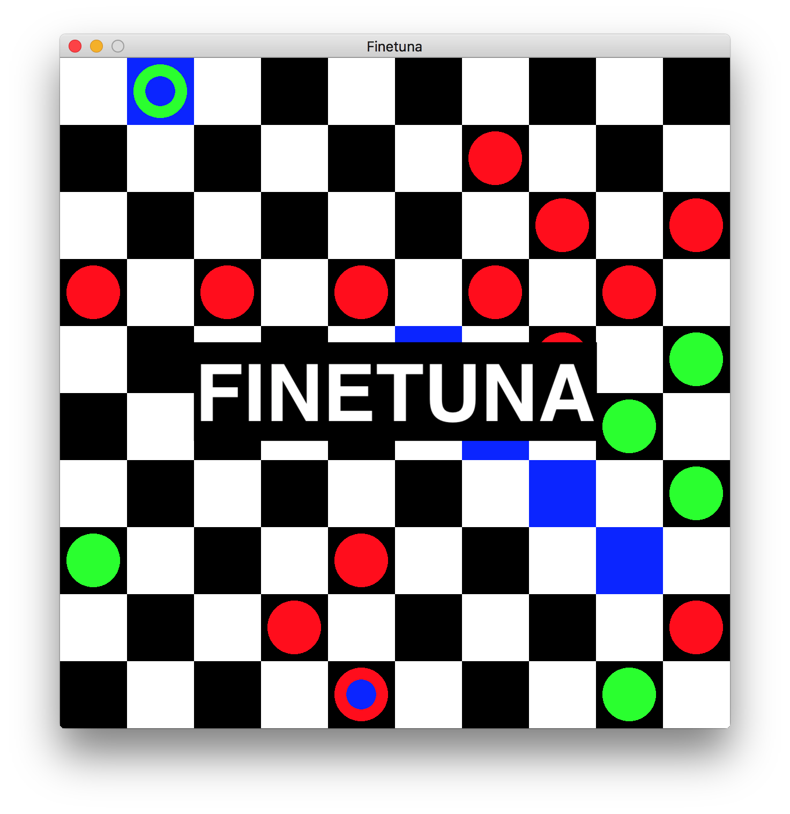

<div align="center">
	<a href="#"> </a>
</div>

----------------------------------------------------------------

### Overview

Finetuna is a free checkers/draughts engine.

### Installation

It requires _liballegro5_, which is available via the [brew](http://brew.sh) or
[MacPorts](https://www.macports.org) package managers.

```
$ brew install allegro
$ make; ./Finetuna
```
